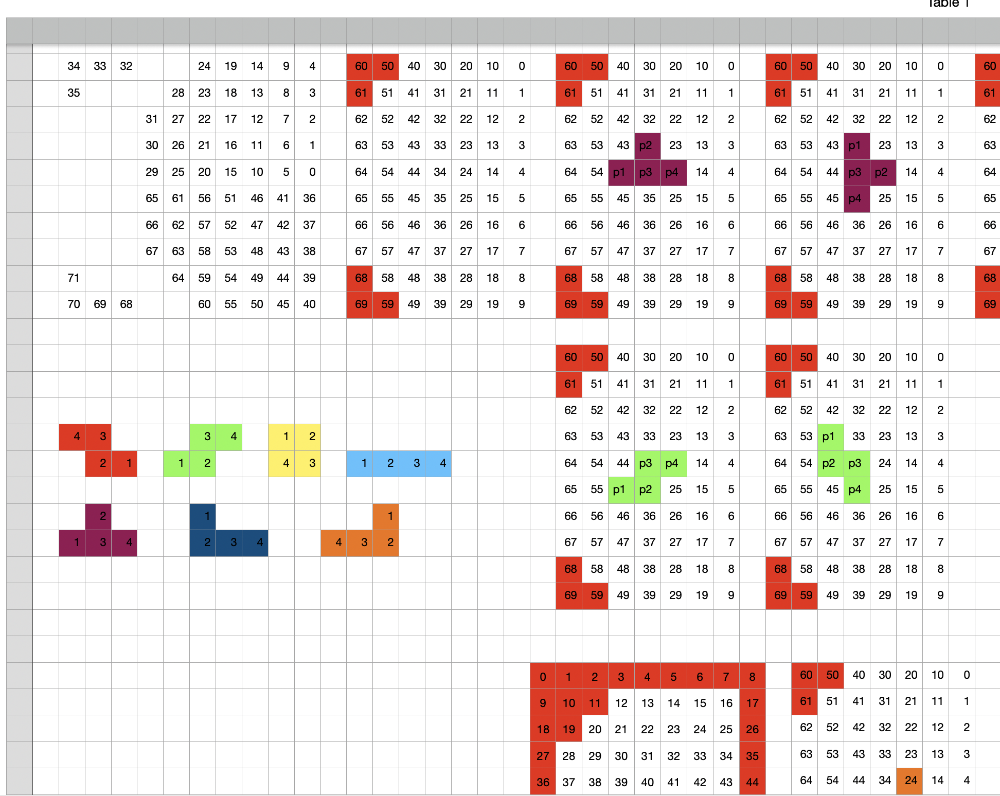

# Keyboard tetris game

# Description

   

This is a fun project I developed while testing [QMK library](https://github.com/qmk/qmk_firmware) with ZSA moonlander.

I was trying to implement custom layout and stumbled upon the article describing custom RGB-lighting and couldn't get past it.

Thumb clusters are used next figure indication and falling figures control.
Field size is 10x7 excepting 6 missing keys (pixels). While clearing the rows these missing
keys are taken into account. So, you need to fill only 5 cells of the last row in order to clear the line.

### Full gameplay

[youtube video link (with audio)](https://youtube.com/shorts/7EGZhT_ZkI4)

  

# Implemented features

1. Spawn all 7 pieces: I, O, Z, S, J, L, T.
2. Rotate and move all pieces.
3. Clear the row if it's covered.
4. Indicate next piece with color.
5. Music theme (I bet it will be deleted).
6. Fair random [algorithm](https://tetris.fandom.com/wiki/Random_Generator).
7. Gameover animation and sound.

# Not implemented features

1. Fancy [SRS](https://tetris.fandom.com/wiki/SRS) rotation.
2. Score counter.
3. Fast move down.

# Controls

1. All the game is controlled using the thumb cluster of the right half of the keyboard.
2. There are also: toggle music button, pause button, restart button, start button.

# How to install

1. Install QMK using the tutorial from [here](https://docs.qmk.fm/#/newbs).
2. Clone this repo.
3. Copy all the content to `<YOU_QMK_FOLDER>/keyboards/moonlander/keymaps/<YOUR_NAME>` or make a symlink.
4. Put your keyboard into bootloader mode. (Click a small button in a hole on a left half of moonlander)
5. Flash the keyboard using [this](https://docs.qmk.fm/#/newbs_flashing?id=load-the-file-into-qmk-toolbox) tutorial.

## Useful links

1. Implementing custom [colorscheme](https://github.com/qmk/qmk_firmware/blob/b110a09886b9d27fea33de2a488e2b74d9baa27e/docs/feature_rgb_matrix.md).
2. Implementing custom [sounds](https://github.com/qmk/qmk_firmware/blob/b110a09886b9d27fea33de2a488e2b74d9baa27e/docs/feature_audio.md).

# Process

Here you can see my tables.

  
## Colors

Top left table is initial colors to keys mapping. Next tables are my
remaps (don't ask why such an order). Red keys are non-existing ones. These rows has less cells
and we need to take it into account while calculating the collisions.

## Rotations

I used the simpliest possible rotation system. All the pieces are rotated around 3 cell.
Kicks are not implemented. The only thing I check here is collisions with walls and other pieces.

## Code quality

Sorry :(

# Gifs

### Game over

    

### Rotate

# Acknowledgement

I found this [repo](https://github.com/rgoulter/qmk_firmware/tree/rgbmatrix-snake/layouts/community/planck_mit/rgbmatrix-snake) somewhere on reddit:  and it was superuseful and helped me a lot
to understand QMK library. Shutout to rgoulter.
